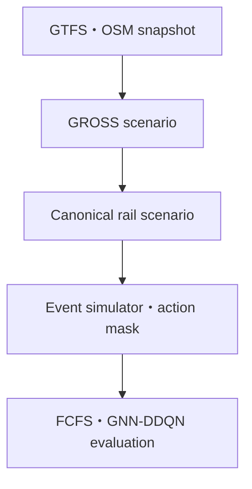

# Open MicroRail 要件定義

| 項目 | 内容 |
| --- | --- |
| 文書ステータス | Draft v0.1 |
| 最終更新日 | 2026-08-18 |
| 対象 | GTFS・OSM・GROSSを用いたMicroRail-inspired railway rescheduling research system |
| 主な利用者 | 研究実装者、実験実施者、コードレビュー担当者 |

## 1. 目的

本プロジェクトは、MicroRailで用いられた非公開の実ネットワーク・運行データを、GTFSおよびOpenStreetMap（OSM）のオープンデータで置き換え、再現可能な列車運行再計画の研究環境を構築する。
このことにより、以下の4点を満たすベースラインを構築する方法を明らかにすることが、目的である。
1. 実際のデータであること
2. 軌道回路ベースで設計することにより、実際の運行指令所での実用化を考慮すること
3. 強化学習活用の可能性を示唆すること
4. オープンデータにより、誰でも同じものを再現可能にすること

GROSSはGTFSとOSMからSUMOシナリオを生成する上流パイプラインとして利用する。GROSSの出力をそのままMicroRailの軌道回路データとみなさず、出典・意味・推定方法を保持した共通シナリオへ変換してから、離散事象シミュレータ、行動マスク、ベースライン、Gymnasium環境、GNN-DDQNへ接続する。

本成果物は、MicroRailの数値結果を厳密に再現することではなく、同論文の問題設定と評価思想を、公開データで検証可能な形に再構成することを目的とする。

## 2. 背景と解くべき問題

MicroRailは、軌道回路をノードとするグラフ、route-lock section-release、列車別の走行・解放時間、事前定義された代替経路を用いて、運行再計画をMarkov Decision Processとして扱う。一方、GTFSは旅客向け時刻表、OSMは協働編集された地理・設備データであり、通常は次の情報を完全には含まない。

- 実際の軌道回路境界と検知方式
- 連動装置の進路・鎖錠・解放条件
- 信号の完全な配置と現示ロジック
- 列車長、加減速特性、編成・分割併合
- 番線運用、待避・行違い規則、指令上の優先規則
- 貨物列車を含む完全な運行計画

したがって、最大の課題は単なるファイル変換ではなく、公開データで観測できる事実と、研究上導入する仮定を混同しない「意味変換層」を構築することである。

## 3. 用語と忠実度の境界

| 用語 | 本文書での定義 |
| --- | --- |
| GROSS scenario | GROSSが生成するSUMOネットワーク、停車位置、経路、列車、設定ファイルおよびログ一式 |
| Canonical rail scenario | GROSS固有XMLと学習環境を分離する、型付き・版管理された中間表現 |
| Resource section | 同時使用を禁止する運行資源の一般名。信号間閉そく、SUMO driveway、検証済み軌道回路などを含む |
| Verified track circuit | 出典データが実際の軌道回路境界であることを確認できる場合だけ使用できる名称 |
| Open-block profile | OSM/SUMOから得られる信号間閉そくまたはdrivewayを資源単位とする既定プロファイル |
| Synthetic section | 信号・分岐器・ホーム等で機械的に分割した研究上の単位。実軌道回路とは呼ばない |
| Operational feasibility | 採用したモデル内の制約を満たすこと。現実の保安装置に対する安全証明を意味しない |

成果物、論文、図表、ログでは、利用したプロファイルと忠実度を必ず明示する。実データで確認できない要素を「実際の軌道回路」「実際の連動」と表現してはならない。

## 4. スコープ

### 4.1 対象範囲

- Static GTFSによる計画時刻表と列車運行の構成
- OSM PBFによる線路、分岐、信号、駅・ホーム候補の構成
- GROSSによるGTFS・OSM整合、停車位置対応付け、経路生成、SUMOシナリオ生成
- GROSS出力からCanonical rail scenarioへの変換
- 信号間閉そくまたはdrivewayを既定資源とする運行グラフ
- 入口遅延等のdisturbanceと、分岐・リンク閉鎖等のdisruption
- 決定論的な離散事象シミュレーション
- WAIT、計画経路維持、事前生成した代替経路への変更
- 資源競合マスク、デッドロック抑制マスク、独立した実行後検証
- FCFSベースライン、Gymnasium互換環境、GNN-DDQN
- 総遅延、実行時間、競合、デッドロック、未完走、一般化性能の評価
- 小規模fixtureから実データ回廊へ段階的に拡張する実験手順

### 4.2 初期対象外

- 実運行への投入または保安用途
- 実在する連動装置の形式的安全証明
- 乗務員・車両運用、分割併合、乗客流動を含む統合再計画
- 全国規模を最初から学習対象とすること
- ライブGTFS-RTを直接用いたオンライン指令
- RECIFE/CPLEXの完全再実装
- MicroRail論文のDB InfraGOデータまたは数値結果の厳密な複製
- OSMやGTFSに存在しない設備属性の自動補完を、事実として扱うこと

## 5. 利用シナリオ

1. 研究者がGTFS・OSM snapshotを指定し、GROSSから再現可能なSUMOシナリオを生成する。
2. 研究者が変換レポートを読み、どの資源が観測値・推定値・仮定値かを確認する。
3. 開発者が小規模fixtureで競合、待機、経路変更、終了条件を高速に検証する。
4. 研究者が同一シナリオと同一マスク上でFCFSと学習方策を比較する。
5. 研究者が未見disruption、時刻表変更、需要・遅延分布変化に対する一般化を評価する。
6. 第三者がmanifest、設定、seed、commit、出力から実験を再実行する。

## 6. 成功条件

- 1つのコマンドまたは明記された段階コマンドで、固定snapshotから同一のCanonical rail scenarioを再生成できる。
- すべての生成要素が、元のGTFS/OSM/GROSS識別子または明示的な仮定へ追跡できる。
- 「実軌道回路」と「公開データから作った代理資源」がデータ上も文書上も区別される。
- 2列車・1競合資源・WAIT・代替経路を持つ小規模fixtureが、CPU上で高速かつ決定論的に完走する。
- 同一資源を互いに排他的な列車が同時予約・占有しないことを、行動マスクとは独立した検証器が確認する。
- 実データ回廊について、入力品質、未対応列車、経路修復、teleport、deadlockを定量レポートできる。
- FCFSとGNN-DDQNを同一のシミュレータ、候補行動、マスク、評価指標で比較できる。
- 学習済みモデルの優劣を単一seedだけで主張せず、複数seedと不確実性を報告できる。

## 7. 機能要件

### 7.1 データ取得・来歴

| ID | 要件 | 受入条件 |
| --- | --- | --- |
| FR-DATA-001 | GTFSとOSMを不変snapshotとして扱う | 取得元、取得日時、対象日、SHA-256、サイズ、ライセンス・帰属情報をmanifestへ記録する |
| FR-DATA-002 | Static GTFSを計画時刻表の正本とする | `routes.txt`、`trips.txt`、`stop_times.txt`、service calendarを検証し、時刻が24:00を超えるGTFS表現も保持する |
| FR-DATA-003 | GTFS-RTは任意の観測・擾乱校正データとする | Static GTFSと混同せず、feed timestamp、entity timestamp、欠測・stale規則を別manifestへ記録する |
| FR-DATA-004 | OSMの元PBFを保存する | 抽出・変換後データから元PBFを上書きせず、OSM IDを変換後も保持する |
| FR-DATA-005 | 入力品質を機械検証する | 必須GTFSファイル、参照整合性、座標範囲、重複、時刻順序、OSM/SUMO経路接続性の検証結果を出力する |
| FR-DATA-006 | 外部入力を非信頼データとして扱う | XMLはDTD・外部entity・network accessを無効化したstream parseのみとし、GZIP/ZIP/XML/YAML/JSON/NPZ/Parquetに入力サイズ・展開後サイズ・要素数・ネストの上限を中央設定する |
| FR-DATA-007 | pathとURIの信頼境界を検証する | 明示的allowlistにないroot外・絶対path、`..`、予期しないsymlink、未許可URI scheme/host/bucket、archiveのpath traversalを拒否し、raw入力はread-onlyで開く |
| FR-DATA-008 | 入力検証失敗時に安全に停止する | 上限超過、hash不一致、schema不一致、未許可path/URIで後段を実行せず、秘密情報や入力全文を出力しないreason codeを返す |

### 7.2 GROSS連携

| ID | 要件 | 受入条件 |
| --- | --- | --- |
| FR-GROSS-001 | GROSSを上流シナリオ生成器として利用する | 利用commitとSUMO versionをmanifestへ固定し、実行コマンドと終了コードを保存する |
| FR-GROSS-002 | ローカル入力を利用できる | `--osm-source`、`--gtfs-source`を用い、既存rawデータを再ダウンロードしなくても実行できる |
| FR-GROSS-003 | 7段階の中間成果を検査可能にする | 少なくとも`final.net.xml.gz`、`stops.add.xml.gz`、`mapping.xml.gz`、`*_pairs.xml.gz`、`*.rou.xml.gz`、ログを契約対象とする |
| FR-GROSS-004 | GROSSによる修復を可視化する | 未経路列車、skip/jump、missing stop、速度不整合、例外リスト、teleportを件数と対象ID付きで報告する |
| FR-GROSS-005 | GROSS失敗を隠さない | 欠落出力、空経路、非ゼロ終了、重大警告がある場合は後段をfail-closedで停止する |

### 7.3 共通シナリオとグラフ

| ID | 要件 | 受入条件 |
| --- | --- | --- |
| FR-GRAPH-001 | GROSS固有形式から版付き中間表現へ変換する | `schema_version`を持ち、同一入力・設定から同一IDと同一内容を生成する |
| FR-GRAPH-002 | 資源の意味を明示する | 各資源が`verified_track_circuit`、`signal_block`、`driveway`、`synthetic_section`のいずれかを持つ |
| FR-GRAPH-003 | 出典と信頼度を保持する | OSM/SUMO/GTFS ID、生成規則、`observed`・`derived`・`assumed`、confidenceを保持する |
| FR-GRAPH-004 | 方向と競合関係を表現する | 物理接続、進行可能方向、対向・支障・排他関係を別の関係として保持する |
| FR-GRAPH-005 | 事前定義した候補経路を生成する | nominal routeと、運行上許可した最大K本のalternative routeを安定した順序で出力する |
| FR-GRAPH-006 | 任意経路探索を行動にしない | 学習時にネットワーク上の任意のpathを生成せず、監査済み候補だけを行動候補とする |

### 7.4 列車・時刻表

| ID | 要件 | 受入条件 |
| --- | --- | --- |
| FR-TT-001 | 各列車の計画を表現する | train ID、service class、stop sequence、planned arrival/departure、entry/exit、nominal routeを保持する |
| FR-TT-002 | 利用できない属性を捏造しない | 貨物・列車長・性能等がなければ`unknown`または明示的assumptionとし、旅客GTFSから推測した事実として扱わない |
| FR-TT-003 | 走行時間の根拠を保持する | GTFS、SUMO経路、速度プロファイル、設定値のどれから得たかを区別する |
| FR-TT-004 | 時刻表の派生版を再生成できる | 列車除外、時刻shift、入口遅延等を元snapshotと変換設定から再現できる |

### 7.5 擾乱・支障シナリオ

| ID | 要件 | 受入条件 |
| --- | --- | --- |
| FR-PERT-001 | link/switch disruptionを表現する | 対象資源または接続、開始時刻、終了時刻、影響方向、生成seedを保持する |
| FR-PERT-002 | primary delay disturbanceを表現する | 対象列車、入口遅延または追加停車時間、生成分布、seedを保持する |
| FR-PERT-003 | 学習・検証・試験を分離する | scenario IDの重複がなく、split manifestを固定する |
| FR-PERT-004 | 論文比較用プロファイルを持つ | disruption duration 5–60分、start 0–60分、6 training＋200 unseen testを設定可能にする |
| FR-PERT-005 | disturbance一般化プロファイルを持つ | 20 scenario、各scenarioで列車の20%へ5–15分の初期遅延を設定可能にする |

論文比較用プロファイルは目標設定であり、候補箇所数やデータ品質が条件を満たさない場合に無理に206件を作ってはならない。その場合は生成可能数と除外理由を報告する。

### 7.6 シミュレーション

| ID | 要件 | 受入条件 |
| --- | --- | --- |
| FR-SIM-001 | 離散事象で状態遷移する | 列車進入、信号接近、dwell完了、WAIT満了を決定momentとして扱う |
| FR-SIM-002 | 同時刻決定を再現可能にする | seed付きの順序決定または安定tie-breakを利用し、選択規則をログへ残す |
| FR-SIM-003 | 資源予約・占有・解放を表現する | formation、running、clearing、releaseの時刻を保持し、資源粒度に適した解放規則を適用する |
| FR-SIM-004 | WAITを扱う | WAITは常に候補とし、既定30秒を設定可能にする。連続WAITを許可する |
| FR-SIM-005 | 終了条件を明確にする | 全列車退出、最大時刻、deadlock、invalid stateを区別して終了する |
| FR-SIM-006 | teleportを解として認めない | 評価対象runでteleportが発生した場合、通常完走ではなくinvalidまたは別カテゴリとして計上する |
| FR-SIM-007 | 同一入力に対し決定論的である | policy、seed、scenario、設定が同一ならイベント列と評価値が同一になる |

### 7.7 行動と実行可能性

| ID | 要件 | 受入条件 |
| --- | --- | --- |
| FR-ACT-001 | 行動集合を限定する | `WAIT`、`KEEP_NOMINAL`、`REROUTE:<route_id>`だけを基本行動とする |
| FR-ACT-002 | 占有・支障資源をmaskする | 候補経路の予約対象に利用不能資源が1つでもあれば、その行動を選択不能にする |
| FR-ACT-003 | デッドロックを抑制する | 対向単線等の既知ルールまたはwait-for graphにより危険行動をmaskし、理由コードを記録する |
| FR-ACT-004 | マスクと検証を分離する | 実行後の独立検証器が、同時予約、経路不連続、時刻逆転等を検出する |
| FR-ACT-005 | 保証範囲を限定する | 競合回避とデッドロック抑制を区別し、形式的なdeadlock-freeを主張しない |

### 7.8 状態・報酬・方策

| ID | 要件 | 受入条件 |
| --- | --- | --- |
| FR-OBS-001 | グラフ状態を返す | node features、edge index、decision train、candidate actions、action maskを一体で返す |
| FR-OBS-002 | MicroRail featureを追跡可能に一般化する | 予約、方向、decision位置、列車class、delay supplement、残走行時間、支障countdown、degree、route usage、current routeを含む |
| FR-OBS-003 | feature schemaを版管理する | class数に応じた次元、正規化統計、欠測処理、計算式をmanifestへ保存する |
| FR-REW-001 | 主目的を総遅延最小化とする | 中間駅の非負到着遅延＋制御領域退出時の非負遅延をepisode objectiveとして報告する |
| FR-REW-002 | shapingを目的値と分離する | delay差、WAIT penalty、route-length penalty/rewardを個別ログし、主目的値へ混ぜない |
| FR-POL-001 | FCFSを必須baselineとする | 学習方策と同一候補経路・同一mask・同一simulatorで実行する |
| FR-POL-002 | DDQNを段階導入する | simulatorとbaselineの受入後にのみGNN-DDQNを実装する |
| FR-POL-003 | 推論budgetを設定可能にする | greedy初期解とsoftmax samplingを分け、60秒等のbudgetを実験設定として記録する |

### 7.9 評価・レポート

| ID | 要件 | 受入条件 |
| --- | --- | --- |
| FR-EVAL-001 | 品質と計算時間を同時評価する | total delay、wall/CPU time、decision count、mask ratioを出力する |
| FR-EVAL-002 | 失敗を品質値で隠さない | conflict、deadlock、timeout、teleport、unfinished train、unrouted trainを別列で報告する |
| FR-EVAL-003 | 行動maskを分析する | occupied、disruption、deadlock prevention、その他の理由別件数を出力する |
| FR-EVAL-004 | 一般化を評価する | unseen disruption、列車削減等の時刻表変化、未見primary delayを別実験として扱う |
| FR-EVAL-005 | 統計的不確実性を報告する | 複数seed、paired scenario比較、平均・中央値・分散またはconfidence intervalを出力する |
| FR-EVAL-006 | 実験を追跡可能にする | git commit、GROSS commit、data hash、config hash、seed、環境versionをresult manifestへ保存する |

## 8. 非機能要件

| ID | 分類 | 要件 |
| --- | --- | --- |
| NFR-001 | 再現性 | 依存関係をlockし、浮動する`latest`や未固定データURLだけに依存しない |
| NFR-002 | 決定論 | seedをPython、NumPy、PyTorch、scenario generatorへ明示的に伝播する |
| NFR-003 | 性能 | unit testとtiny integration testは大規模データ・GPUなしでCI実行できる |
| NFR-004 | 拡張性 | GROSS adapter、domain model、simulator、Gymnasium adapter、policyを分離する |
| NFR-005 | 監査性 | 推定・修復・除外・fallbackを構造化ログとmanifestへ残す |
| NFR-006 | 可搬性 | coreはLinux CPUで動作し、GROSSはDocker経由で再現できる |
| NFR-007 | データ保全 | `data/raw/`を不変とし、大規模生成物、model、logをGitへcommitしない |
| NFR-008 | 研究公正 | 実測値、派生値、仮定値を区別し、検証していない現実適用可能性を主張しない |
| NFR-009 | 保守性 | public APIにtype hintとdocstringを付け、設定・I/O・domain logicを分離する |
| NFR-010 | セキュリティ | credential、signed URL、個人情報、AWS secretをコード・設定・ログへ保存しない |
| NFR-011 | 入力安全性 | 外部データのparserとarchive展開はresource上限とpath/URI検証を持ち、XXE、decompression bomb、path traversal、SSRFをfail-closedで拒否する |
| NFR-012 | artifact安全性 | 未信頼のpickleまたは実行可能checkpointをloadせず、inferenceは原則としてweights-only形式と検証済みmanifest/hashを使用する |
| NFR-013 | 実行隔離 | GROSS/container/subprocessは最小権限、resource/time上限、read-only raw mount、原則networkなしで実行し、shell文字列を組み立てずargvで起動する |
| NFR-014 | supply-chain管理 | lockとdigest固定に加え、dependency/containerの脆弱性監査とbaseline/maintenance profileの更新方針を持つ |

## 9. 段階別の受入基準

### Gate 0: Repository and source audit

- 既存repository構造、schema、tests、生成済みデータを一覧化する。
- GROSS `d1134079021eab78fb40fb1e30580809d396f00e` とSUMO compatibilityを記録する。
- GROSSのライセンス状態を確認する。明示ライセンスがない間は、コードをvendor・改変再配布せず外部実行物として扱う。
- GTFS/OSM snapshotと対象回廊を確定する。
- 資源粒度を`open_block`、`synthetic_section`、`verified_track_circuit`から選び、根拠を記録する。
- 信頼境界を一覧化し、外部入力、archive、path/URI、subprocess/container、checkpoint、log、cloudごとに所有モジュールと拒否条件を決める。
- security limitを中央設定するschemaと、安全な既定値・超過時のreason codeを決める。

### Gate 1: Tiny deterministic vertical slice

- 小さなグラフ、2列車、1つの競合資源、1つのWAIT、可能なら1つの代替経路をfixtureで表現する。
- event transition、予約・解放、mask、FCFS、完走、total delayを実装する。
- unit test、property test、end-to-end integration testがCPUで成功する。
- neural network、AWS、大規模GROSS runはまだ導入しない。
- Gate 1で新たに導入したparser、path、archive、subprocess境界だけをtiny malicious fixtureで検証し、拒否時に状態・出力を変更しない。未実装のGROSS/XML境界はGate 2まで要求しない。

### Gate 2: Open-data corridor scenario

- 固定したGTFS/OSMをGROSSへ入力し、必要出力を生成する。
- Canonical rail scenarioへ変換し、全IDの来歴と資源粒度を検証する。
- nominal routeが接続し、stop sequenceと計画時刻が単調である。
- 未経路・修復・teleport・deadlock・除外列車をレポートする。
- 代表回廊の無擾乱runを完走または失敗理由付きで終了する。
- GROSS/XML adapterがDTD/entity、path traversal、展開後サイズ上限超過、YAML未許可tagを状態・出力変更なしに拒否する。
- GROSSをcontainerで実行する場合、non-root、no-new-privileges、capability drop、raw read-only mount、CPU/RAM/PID/time上限、原則network無効を実行manifestとsmoke testで確認する。

### Gate 3: Baseline and Gymnasium environment

- disruptionとprimary delayをseed付きで生成する。
- FCFSが同一mask上で安定して実行できる。
- Gymnasium API validation、seed reproducibility、invalid action behaviorがテスト済みである。
- 複数scenarioのpaired evaluationを生成できる。

### Gate 4: GNN-DDQN benchmark

- replay buffer、online/target network、masked DDQN updateを実装する。
- tiny fixtureを過学習でき、学習lossとpolicy改善のsanity checkを通る。
- open-data scenarioで複数seedを学習し、FCFSとのpaired comparisonを出力する。
- reward ablation、WAIT 15/30/60秒、GNNなしbaselineを設定から実行できる。

## 10. 主要なリスクと対応

| リスク | 影響 | 対応 |
| --- | --- | --- |
| GTFS/OSMから実軌道回路を得られない | MicroRailとの粒度差 | signal block/drivewayを既定代理資源とし、名称・schema・論文記述で明示する |
| GROSS repositoryに明示的LICENSEが見当たらない | 再利用・再配布判断が不確実 | commitを外部依存として実行し、vendor前に著者・権利者へ確認する |
| GROSS Dockerfileが`ubuntu:latest`、PPA stable、未固定pipを使用 | 将来の再現性低下 | wrapper imageとversion manifestを作り、SUMO 1.26.0 compatibility baselineを固定する |
| GTFSが旅客列車中心 | MicroRailの旅客・貨物2classを再現できない | 利用可能classをschema化し、貨物を推測で追加しない |
| OSM信号・番線タグの欠測 | 資源・候補経路の誤り | coverage report、confidence、manual review list、fail-closed thresholdを導入する |
| SUMO teleportが見かけ上の完走を作る | 評価の妥当性低下 | teleportを失敗カテゴリとして分離し、学習の成功に数えない |
| 行動maskだけに安全性を依存 | 実装bugを見逃す | simulator外のindependent feasibility validatorとproperty testを持つ |
| 大規模シナリオへ早期拡張 | デバッグ不能・計算資源浪費 | tiny fixture→回廊→地域のgateを順守する |

## 11. 未確定事項

次の項目は実装前のGate 0で確定し、決定記録へ残す。

- 初期対象回廊と境界。候補はDresden-Neustadt–Dresden-Mitte–Dresden Hbfだが、snapshot coverageとGROSS結果で確定する。
- 利用するStatic GTFSの提供者、snapshot日、対象service day。
- OSM取得方法。小規模抽出またはGeofabrik PBFのどちらを正本とするか。
- `open_block`で利用する資源単位をSUMO signal block、driveway、sub-drivewayのどこまで細分化するか。
- formation、release、train length等の非公開属性に対する設定値と感度分析範囲。
- alternative routeの最大K、detour上限、manual allow/deny規則。
- open-data版の列車class vocabulary。
- GROSSライセンス確認後の統合方法。

## 12. 出典と要件の対応

| 出典 | 採用した要素 | 本文書の対応 |
| --- | --- | --- |
| MicroRail §3–4 | 総遅延目的、MDP、決定moment、WAIT/route action、mask、reward shaping | FR-SIM、FR-ACT、FR-OBS、FR-REW |
| MicroRail §4.1.1 | graph stateとnode features | FR-OBS |
| MicroRail §4.2 | GNN＋DDQN、replay、target update | FR-POL、Gate 4 |
| MicroRail §5 | FCFS、6/200 scenario、一般化・ablation | FR-PERT、FR-EVAL |
| GROSS §3 | GTFS/OSM、station matching、two-layer routing、repair | FR-DATA、FR-GROSS、FR-GRAPH |
| GROSS §4–6 | teleport、delay、deadlock、data limitation | FR-SIM、FR-EVAL、リスク |
| GROSS公開repository | 7-stage pipelineと具体的出力 | FR-GROSS、Gate 0/2 |
| SUMO railway documentation | signal block、driveway、deadlock、rail outputs | `open_block`資源定義と検証 |

## 13. Definition of Done

ある変更を完了とみなすには、次をすべて満たす。

- 対応する要件IDと変更理由が明記されている。
- rawデータを変更していない。
- 新しい仮定・fallback・schema変更が文書化されている。
- relevant automated testsが成功している。
- 変更機能を通る最小runtime checkが成功している。
- 生成物にcommit、data hash、config hash、seedが残る。
- 未実行の検証と理由が報告されている。
- 競合なし、deadlockなし、teleportなし等の主張は、対応する検証結果に基づく。

## 14. 参照資料

- [MicroRail_TUD.pdf](https://drive.google.com/file/d/1JLT7LZz8vdZxhokC3TUhxk9MwxOsE0jO/view)
- [GROSS_ETHZürich.pdf](https://drive.google.com/file/d/1ygzwbwCLsYF0B4vPHgj9EeNotkK8Kcu5/view)
- [GROSS repository](https://github.com/ethz-coss/GROSS)
- [SUMO railway simulation documentation](https://sumo.dlr.de/docs/Simulation/Railways.html)
- [GTFS Schedule Reference](https://gtfs.org/documentation/schedule/reference/)
