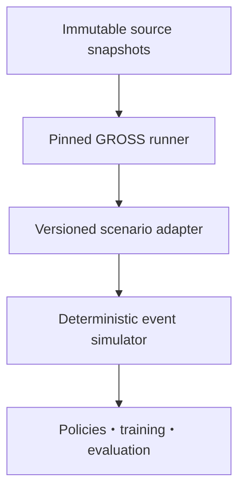

# Open MicroRail 技術要件

| 項目 | 内容 |
| --- | --- |
| 文書ステータス | Draft v0.1 |
| 最終更新日 | 2026-08-18 |
| 上位文書 | [`requirements.md`](requirements.md) |
| 適用範囲 | scenario generation、canonical data、simulation、RL、evaluation |

本文書の「必須」は受入に必要な条件、「推奨」は合理的な初期値、「禁止」は研究結果の妥当性またはデータ保全を損なう実装を示す。

## 1. アーキテクチャ

システムは、外部データ形式、運行意味論、学習実装を分離する。



### 1.1 レイヤ責務

| レイヤ | 責務 | 禁止事項 |
| --- | --- | --- |
| Source | GTFS/GTFS-RT/OSMの保存、hash、license、取得情報 | 派生処理によるraw上書き |
| GROSS runner | 固定versionで7-stage pipelineを実行し、完全な出力とログを保持 | GROSS outputを実軌道回路と呼ぶこと |
| Scenario adapter | GROSS XMLを型付きCanonical rail scenarioへ変換し、来歴を保持 | 欠測設備を無言で生成すること |
| Domain/simulator | 資源、列車、予約、event、action、mask、objectiveを実装 | XML parsingやPyTorch依存をdomain logicへ混在させること |
| Environment | simulatorをGymnasium形式へ適合させる | simulatorの意味論をwrapper内で変更すること |
| Learning | graph encoder、masked DDQN、replay、inference search | 実行可能性をneural networkだけに委ねること |
| Evaluation | paired run、集計、失敗分類、provenance | deadlock/teleportを総遅延だけへ埋め込むこと |

## 2. 推奨repository構成

既存repositoryをGate 0で監査し、同等の責務分離がすでにある場合は既存構成を優先する。単にこの構成へ合わせるための大規模移動は行わない。

```text
.
├── CLAUDE.md
├── pyproject.toml
├── uv.lock
├── configs/
│   ├── scenarios/
│   ├── experiments/
│   └── assumptions/
├── data/
│   ├── raw/                 # immutable, not committed
│   ├── interim/gross/       # GROSS outputs, not committed
│   ├── processed/scenarios/ # canonical scenarios, normally not committed
│   └── fixtures/            # tiny synthetic data only
├── docs/
│   ├── requirements.md
│   ├── technical-requirements.md
│   ├── technology-decisions.md
│   └── decisions/
├── references/
│   └── papers/              # local paper copies when legally permitted
├── src/railway_rl_lab/
│   ├── ingestion/
│   ├── security/            # SecurityLimits, safe parser/path/URI/archive/subprocess/checkpoint boundaries
│   ├── domain/
│   ├── topology/
│   ├── simulation/
│   ├── envs/
│   ├── policies/
│   ├── learning/
│   ├── evaluation/
│   └── cli/
├── tests/
│   ├── unit/
│   ├── property/
│   ├── integration/
│   └── fixtures/
└── third_party/
    └── README.md             # dependency metadata only; no unlicensed vendoring
```

## 3. Version・実行環境

### 3.1 Core application

- Pythonは`>=3.12,<3.13`を初期互換範囲とし、Gate 0のcompatibility check後に`pyproject.toml`へ固定する。
- Python dependencyとcommand executionには`uv`のみを使用する。
- exact dependencyは`uv.lock`へ固定し、手作業でlock内容を編集しない。
- core testはLinux CPUで実行可能でなければならない。
- PyTorch/CUDAの組合せは別lockまたは明示したinstallation profileで管理し、CPU CIにCUDA packageを要求しない。

### 3.2 GROSS compatibility baseline

- GROSS repositoryは [GROSS Initial Pipeline Commit](https://github.com/ethz-coss/GROSS/commit/d1134079021eab78fb40fb1e30580809d396f00e)を初期baselineとする。
- GROSS論文の実験条件に合わせ、SUMO 1.26.0を初期compatibility baselineとする。
- upstreamの`ubuntu:latest`、PPA `stable`、未固定pip dependencyに直接再現性を依存してはならない。
- 実行時には少なくともGROSS commit、container image digest、SUMO version、compiler version、Python versionをmanifestへ記録する。
- GROSSのLICENSEが確認できるまで、GROSS sourceを本repositoryへcopy・vendor・派生配布しない。外部checkoutまたは外部containerとして実行する。

## 4. データ配置とmanifest

### 4.1 Raw data

`data/raw/`配下はimmutable source dataである。既存GTFS、GTFS-RT protobuf、OSM PBFを削除・上書きしない。大規模データはGit外に置き、pathまたはobject URIをmanifestから参照する。

推奨配置:

```text
data/raw/
├── gtfs/<provider>/<snapshot_id>/
├── gtfs_rt/<provider>/<capture_id>/
└── osm/<provider>/<snapshot_id>/<region>.osm.pbf
```

### 4.2 Source manifest

各snapshotは次の情報を必須とする。

```yaml
schema_version: railway-rl.source-manifest.v1
source_id: <stable-id>
kind: gtfs | gtfs_rt | osm
provider: <provider>
source_url: <original-url>
retrieved_at: <ISO-8601>
service_date: <YYYY-MM-DD-or-null>
sha256: <hex>
size_bytes: <integer>
license_name: <declared-license-or-unknown>
attribution: <required-attribution-or-unknown>
local_path: <repo-relative-or-external-ref>
```

`source_url`に一時signed URLやcredentialを保存してはならない。

### 4.3 Experiment manifest

すべての評価runは次を含む。

- scenario IDとscenario schema version
- source manifest IDとhash
- GROSS commit、SUMO version、container digest
- application git commitとdirty-state flag
- config pathとconfig SHA-256
- split ID、scenario seed、policy seed、framework seeds
- observation/reward/action schema version
- policy checkpoint hash
- start/end timestamp、wall time、CPU time
- termination reasonとfailure flags

## 5. GROSS adapter contract

### 5.1 必須入力

- OSM `.osm.pbf`またはGROSSが受理する分割PBF directory
- 展開済みStatic GTFS directory
- scenario name、country/region、service date
- GROSS commit、SUMO profile、routing thread数

### 5.2 必須GROSS出力

| GROSS output | 用途 |
| --- | --- |
| `sumo/final.net.xml.gz` | 線路edge、junction、connection、rail signalの正本 |
| `sumo/stops.add.xml.gz` | SUMOへsnapされた停車位置 |
| `misc/mapping.xml.gz` | GTFS stopとOSM/SUMO stopの対応 |
| `misc/output_gtfs.xml.gz` | GROSSが解釈したGTFS運行情報 |
| `routing/*_pairs.xml.gz` | speed class別のstation pair routing |
| `sim/highspeed.rou.xml.gz` | high-speed列車のroute/vehicle |
| `sim/intercity.rou.xml.gz` | intercity列車のroute/vehicle |
| `sim/regional.rou.xml.gz` | regional列車のroute/vehicle |
| `misc/logs/*` | netconvert、unrouted、repair等の監査情報 |

存在するspeed classだけを要求し、空classをエラーとしない。ただし、全route fileが空の場合はfatal errorとする。

### 5.3 Adapter処理順

1. source hash、GROSS commit、SUMO version、required outputを検証する。
2. `final.net.xml.gz`からedge、lane、junction、connection、rail signal、bidi relationを読む。
3. `stops.add.xml.gz`と`mapping.xml.gz`からGTFS stop–SUMO stop対応を構築する。
4. `*.rou.xml.gz`から列車、計画時刻、nominal edge sequence、service classを読む。
5. signal block/driveway候補と競合関係を構築する。
6. nominal routeを資源列へ変換し、接続・方向・stop orderを検証する。
7. candidate alternative routeを制約付きで生成する。
8. 修復、fallback、除外、confidenceを変換レポートへ書く。
9. schema validationとdomain invariantを通過した場合だけcanonical artifactを公開する。

### 5.4 Rail resource discovery

既定の`open_block` profileでは、SUMOのrail signalが保護するsignal blockまたはdrivewayをResource sectionとして使う。

- `--railsignal-block-output`を用いたdiscovery runにより、drivewayのforward/bidi/flank lanesとfoe drivewaysを取得できる。
- 同outputは最初に利用した列車により発見されるdrivewayへ依存するため、1回の通常runだけを完全な網羅とみなしてはならない。
- timetableで使用する全nominal/alternative movementをprobeし、未発見movementをcoverage errorとして報告する。
- static network解析とdiscovery outputが不一致の場合は自動的に片方を正とせず、対象IDをmanual reviewへ送る。
- 実際のtrack circuit boundaryが別データで検証されない限り、node/entity名に`track_circuit`を使用しない。

## 6. Canonical rail scenario schema

### 6.1 Scenario header

```yaml
schema_version: open-microrail.scenario.v1
scenario_id: <stable-id>
service_date: <YYYY-MM-DD>
timezone: <IANA-timezone>
resource_profile: open_block | synthetic_section | verified_track_circuit
has_verified_track_circuits: false
source_manifests: [<source-id>]
generator:
  gross_commit: d1134079021eab78fb40fb1e30580809d396f00e
  sumo_version: 1.26.0
  adapter_version: <git-commit>
assumption_profile: <config-id>
```

### 6.2 Domain entities

| Entity | 必須field |
| --- | --- |
| `InfrastructureNode` | `id`, `kind`, `geometry`, `source_refs`, `provenance` |
| `ResourceSection` | `id`, `kind`, `directed_lanes`, `length_m`, `conflicts`, `boundary_signals`, `granularity`, `provenance`, `confidence` |
| `StationStop` | `id`, `gtfs_stop_ids`, `sumo_stop_id`, `resource_id`, `mapping_method`, `distance_m`, `confidence` |
| `TrainPlan` | `train_id`, `service_class`, `stops`, `entry_s`, `exit_s`, `nominal_route_id`, `source_refs` |
| `StopCall` | `sequence`, `stop_id`, `arrival_s`, `departure_s`, `pickup/dropoff` |
| `RouteCandidate` | `route_id`, `train_id`, `resource_ids`, `edge_ids`, `travel_time_s`, `distance_m`, `is_nominal`, `generation_method` |
| `OperationalTiming` | `train_id`, `route_id`, `resource_id`, `running_s`, `clearing_s`, `formation_s`, `release_s`, `provenance` |
| `Perturbation` | `id`, `type`, `targets`, `start_s`, `end_s/delay_s`, `seed`, `generation_profile` |

### 6.3 Provenance

すべての派生fieldは次のいずれかを持つ。

- `observed`: sourceに明示された値
- `derived`: 明示された決定論的変換で計算した値
- `assumed`: 設定または研究上の仮定
- `unknown`: 利用不能であり補完していない値

`assumed`には`assumption_id`、値、単位、根拠、感度分析範囲を紐付ける。

## 7. 時刻・列車性能

- canonical timeはservice day開始からの秒で表現し、GTFSの24時間超表現を保持する。
- IANA timezoneはGTFS `agency_timezone`から取得し、UTCへの変換は別fieldとする。
- 浮動小数のSUMO時刻を扱う場合でも、比較時のtoleranceを中央設定に置く。
- `running_s`は優先順に、検証済みspeed profile、SUMO nominal traversal、GTFS区間時間から導出する。採用元を記録する。
- `clearing_s`は列車長と速度が必要である。列車長が不明なら`assumed`としてprofile化し、1値だけで結論を出さない。
- `formation_s`と`release_s`は公開データにない場合が多い。MVPで0を採用する場合も、`assumed_zero_for_mvp`として明示し、現実値とは呼ばない。
- reroute・WAIT後も速度profileを固定するMicroRail仮定を再現するprofileと、SUMOによる動的走行時間を使うprofileを混在させない。

## 8. 代替経路生成

代替経路は学習中に無制限探索せず、scenario build時に生成・検証する。

### 8.1 必須制約

- trainの現在位置から次のrouting decision boundaryまで接続する。
- vehicle class、方向、停車駅順序、必須停車を満たす。
- disruption対象を避ける候補を生成できる。
- nominal routeに対するdistance/time detour上限を設定する。
- U-turn、不要な反転、同一資源の不自然な反復を拒否する。
- 最大候補数`K`を設定し、`route_id`順またはcost順の安定したorderingを持つ。
- manual allow/deny listを版管理する。

### 8.2 候補の同一性

`route_id`はscenario ID、train pattern、edge/resource sequence、generation configのhashから決定し、runごとに変化する配列indexをIDにしない。

## 9. 離散事象シミュレータ

### 9.1 State

最低限、次を保持する。

- current simulation time
- 各列車のlocation、route progress、planned/estimated time、status
- 各resourceのreservation、occupancy、release event
- active perturbations
- event priority queue
- pending decision train
- wait-for dependenciesとtermination state

### 9.2 Decision moments

- train entry
- signal/resource boundaryへの接近
- scheduled dwell completion
- WAIT interval completion

同一時刻のdecision順序はseed付きpermutationまたは文書化した安定tie-breakを使う。どちらの場合もevent logから再現できること。

### 9.3 Reservation semantics

- `verified_track_circuit`では、根拠データが許す場合にsection releaseを実装する。
- `open_block`では、block/driveway単位のreservationとreleaseを実装し、MicroRailのtrack-circuit section releaseと同一と主張しない。
- 予約対象にはforward resourcesだけでなく、bidi、flank、foe conflictを含める。
- resourceの同時reservation/occupancyは禁止する。
- perturbation開始前に既に予約済みの列車を通すか否かはassumption profileで固定する。MicroRail互換profileでは通行を許可する。

### 9.4 Termination

`COMPLETED`、`TIME_LIMIT`、`DEADLOCK`、`CONFLICT`、`INVALID_INPUT`、`TELEPORT_DETECTED`、`ERROR`を区別する。失敗を大きな遅延値だけへ変換しない。

## 10. Actionとmask

### 10.1 Action candidate

```text
WAIT:<duration_s>
KEEP_NOMINAL:<route_id>
REROUTE:<route_id>
```

各候補はstable ID、type、route ID、resource sequence、estimated time、distance delta、mask state、mask reasonsを持つ。

### 10.2 Mask reason code

- `RESOURCE_RESERVED`
- `RESOURCE_OCCUPIED`
- `DISRUPTION_ACTIVE`
- `DIRECTION_CONFLICT`
- `FLANK_CONFLICT`
- `DEADLOCK_RISK`
- `ROUTE_DISCONNECTED`
- `OPERATIONAL_RULE`

WAITは常に存在する。ただし最大運行時刻を超えるWAITはepisode terminationとの関係を明示する。

### 10.3 独立検証

action maskとは別moduleで、実行後に次を検証する。

- mutual exclusion
- route continuity
- monotonic event time
- stop order
- legal transition
- release-before-reuse
- perturbation compliance

検証器はpolicy、GNN、mask implementationをimportしてはならない。

## 11. Observation schema

MicroRailの12 featureをそのまま固定せず、train class数を一般化した`open-block-v1`を定義する。node feature dimensionは`10 + C`（`C`はclass vocabulary数）とする。

| 順序 | Feature | 計算 |
| --- | --- | --- |
| 0 | reserved | resourceが任意列車に予約済みなら1 |
| 1 | direction | occupying/reserving trainの方向。未使用は0 |
| 2 | decision_location | decision trainの現在decision resourceなら1 |
| 3..`2+C` | train_class | occupying/reserving trainのone-hot。未使用・unknownの扱いをschema化 |
| `3+C` | time_supplement | planned next arrival − estimated next arrivalを学習統計で正規化 |
| `4+C` | remaining_runtime | 残走行時間 / 計画総走行時間 |
| `5+C` | disruption_start_countdown | 対象支障開始までの正規化時間。予見不可profileでは0 |
| `6+C` | disruption_end_countdown | 対象支障終了までの正規化時間 |
| `7+C` | degree | directed operational graphのdegreeを正規化 |
| `8+C` | route_usage | nominal/alternative routeにおける利用比率 |
| `9+C` | on_candidate_route | decision trainのcurrent/candidate route上なら1 |

### 11.1 Feature要件

- vocabulary、feature order、normalizerをcheckpointとともに保存する。
- normalization統計はtraining splitだけから算出し、test leakageを防ぐ。
- unknown classを全0にするか専用classにするかをschemaで固定する。
- 空resource上の列車依存featureは0とし、意味を文書化する。
- graph edgeは物理隣接と競合関係を混ぜず、必要ならedge typeを持つ。

## 12. Gymnasium interface

domain simulatorは可変サイズgraphを返す。Gymnasium adapterはexperiment manifestで定めた`max_nodes`と`max_actions`へpaddingし、実サイズとmaskを返す。

```text
observation = {
  node_features: float32[max_nodes, feature_dim],
  edge_index: int64[2, max_edges],
  edge_type: int16[max_edges],
  node_count: int32,
  edge_count: int32,
  action_features: float32[max_actions, action_feature_dim],
  action_mask: bool[max_actions],
  action_count: int32,
  decision_train_index: int32,
}
```

- 上限超過はtruncateせず明示エラーにする。
- `reset(seed=...)`はscenario samplingとsimulator tie-breakへseedを伝播する。
- masked actionを`step`へ渡した場合は状態を変更せず、明示例外または標準化したinvalid resultを返す。挙動をtestする。
- `terminated`と`truncated`をGymnasium semanticsに従って分ける。

## 13. Objectiveとreward

### 13.1 Episode objective

$$
F = \sum_{h \in H}\sum_{i \in I}\max(0, a_{i,h}-a'_{i,h})
  + \sum_{i \in I}\max(0, ex_i-ex'_i)
$$

早着はobjectiveを減らさない。未完走列車は通常objectiveへ恣意的penaltyを加えるだけで処理せず、termination failureとして別報告する。

### 13.2 Step reward

$$
r_t = [delay_i(t)-delay_i(t+1)] + \alpha r_t^{wait} + \beta r_t^{route}
$$

- `r_wait = -1` for WAIT、otherwise 0
- `r_route = +1` for shorter reroute、`-1` for longer reroute、otherwise 0
- MicroRail互換profileの初期値は`alpha=1`、`beta=1`
- main reportではshaped returnではなくepisode objective `F`を比較する
- reward componentを別々にlogする

## 14. Baseline policy

FCFSは同一simulatorとmaskを利用する。

1. 同一資源を要求する列車では、resource boundaryへの到着が早い列車を優先する。
2. nominal routeが実行可能なら維持する。
3. disruptionでnominal routeが使えない場合、実行可能な候補のうち推定走行時間が最短のrouteを選ぶ。
4. 進行行動がなければWAITを選ぶ。
5. tie-breakはstable train IDまたはseed付き規則とし、記録する。

FCFS固有の追加安全ロジックを持たせず、学習方策と同じmaskを使う。

## 15. GNN-DDQN

### 15.1 Model interface

可変数actionを扱うため、graph encoderとcandidate-action scorerを分離する。

1. node featureをhidden representationへencodeする。
2. 4回のmessage passingを行う。
3. graph poolingとdecision-local embeddingを作る。
4. 各candidate actionのfeatureと結合して1候補ずつQ値をscoreする。
5. maskされたQ値をaction selectionとtarget calculationの両方から除外する。

固定順序の巨大なglobal action headは、network sizeとcandidate数に依存し一般化を阻害するため採用しない。

### 15.2 Paper-compatible initial profile

| Parameter | Initial value |
| --- | --- |
| Message-passing iterations | 4 |
| Node hidden dimension | 24を再現profileとして用意。ただし`feature_dim > 24`ならhiddenを拡張する |
| Message MLP | 1 hidden layer、64 units、SELU |
| Readout MLP | 2 hidden layers、35/35 units、SELU |
| Discount `gamma` | 1.0 |
| Learning rate | `1e-4` |
| Batch size | 64 |
| Replay capacity | `1_000_000`を上限profileとし、MVPはmemory測定に応じて縮小可能 |
| Soft update `tau` | `1e-3` |
| Optimizer | SGD |
| L2 | 0.1 |
| Dropout | `1e-2` |
| Epsilon | 1.0を100 episode維持後、0.997倍、下限0.01 |
| WAIT duration | 30秒 |

これらは論文由来のbaselineであり、open-data版の最適値ではない。設定へ外出しし、変更時はexperiment IDを変える。

### 15.3 DDQN correctness

- online networkで次actionを選び、target networkでそのQ値を評価する。
- terminal transitionではbootstrapしない。
- next-state maskをtarget action selectionへ必ず適用する。
- replay itemはscenario ID、decision train、state schema version、action ID、reward components、terminationを保持する。
- checkpointはmodel、optimizer、normalizer、class vocabulary、config、RNG stateを含む。

## 16. Inference

- 最初にgreedy rolloutを行い、数秒以内の初期解を得る。
- 残りbudgetでmasked Q-valueのsoftmax samplingによる複数rolloutを実行できる。
- sampling温度、budget、rollout数、best-selection criterionを記録する。
- 同一budget比較ではenvironment initializationとscenarioを共有する。
- wall-clock budgetと固定rollout数の結果を分けて報告する。

## 17. Security implementation contract

この節は外部入力・artifact・外部processの実装に対する必須契約である。「安全に処理する」のような抽象的な実装判断を各adapterへ委ねず、共通boundary moduleと型付き設定で一元化する。

### 17.1 Trust boundaries and limits

- GTFS、GTFS-RT、OSM、GROSS/SUMO出力、manifest、config、archive、Parquet/NPZ、checkpoint、object URIは、hashが記録されていても既定では非信頼入力とする。
- `SecurityLimits`相当の版付き設定に、少なくとも`max_input_bytes`、`max_decompressed_bytes`、`max_archive_members`、`max_xml_elements`、`max_xml_depth`、`max_text_bytes`、`max_subprocess_seconds`、`max_captured_log_bytes`を正の有限値として定義する。`None`や無制限を既定にしない。
- 初期値はGate 0でtiny fixtureと対象回廊の実測値に安全率を掛けて決め、単一ファイル、run全体、test profileを分ける。上限変更はconfigとmanifestへ残す。
- 違反時は入力名、limit名、観測値、reason codeだけを返し、入力全文、URL query、環境変数、credentialを例外やログへ含めない。
- 最低限のreason codeは`INPUT_TOO_LARGE`、`DECOMPRESSED_TOO_LARGE`、`ARCHIVE_MEMBER_LIMIT`、`UNSAFE_ARCHIVE_PATH`、`XML_DTD_FORBIDDEN`、`XML_ENTITY_FORBIDDEN`、`PATH_OUTSIDE_ALLOWED_ROOT`、`URI_NOT_ALLOWED`、`HASH_MISMATCH`、`SCHEMA_MISMATCH`、`UNSAFE_ARTIFACT_FORMAT`、`SUBPROCESS_TIMEOUT`、`CAPTURE_LIMIT_EXCEEDED`とする。adapter固有codeはこの分類を失わず追加する。

### 17.2 Parser and archive rules

- XML parserはDTD、外部entity、XInclude、schemaによる外部取得、network accessを無効化し、巨大tree optionを有効化しない。stream parseし、処理済み要素を解放する。
- 圧縮入力は展開しながら展開後byte数を数え、上限超過時点で停止する。headerの申告サイズだけを信用しない。
- ZIP/TARを扱う場合、member数と合計展開量を検証し、絶対path、`..`、drive prefix、symlink/hardlink/device entry、許可root外へ解決されるmemberを展開前に拒否する。一括`extractall`を直接使用しない。
- YAMLはsafe loaderのみを使い、custom object tag、未知field、過剰なalias/anchor、深いnestを拒否する。JSON/YAMLはPydantic境界で型・範囲・未知field方針を検証する。
- NPZは`allow_pickle=False`で読み、Parquet/Arrowは必要columnだけを読み、schemaとrow/byte上限を先に検証する。

### 17.3 Path, URI, and download rules

- repository内参照は正規化後のrepo-relative pathを既定とする。外部local dataはversioned allowlistに登録したroot配下だけを許可する。
- pathは`resolve`後にも許可root配下であることを確認する。symlinkを許可する場合も、最終解決先を同じ検査へ通す。raw sourceはread-only handleまたはread-only mountで開く。
- remote fetchを実装する場合、HTTPSと明示したhost/bucket allowlistだけを許可し、redirect後のURLも再検証する。`file:`、loopback、link-local、private network、instance metadata endpoint、userinfo付きURLを拒否する。
- downloadはtimeout、最大byte数、redirect回数を必須とする。publisher checksum等のexpected hashがあれば事前検証し、なければquarantineへ保存してhash・schema・sizeを検証後にsnapshotとしてatomic promoteする。credential、signed query、bearer URLは永続manifestとログからredactする。
- pathやURLをshell commandへ補間しない。subprocessは検証済み`list[str]`、`shell=False`、固定cwd、最小環境、timeout、終了コード検査、capture上限付きで起動する。

### 17.4 Checkpoint and artifact rules

- inference用artifactはmodel state、normalizer、vocabulary、schema/config IDを分離し、manifestとhashを検証してからloadする。
- PyTorchは可能な限り`torch.load(..., weights_only=True)`相当を使用し、state dictのkey、dtype、shape、総parameter数をmodel schemaと照合する。未信頼pickle、任意classを復元するloader、`allow_pickle=True`を禁止する。
- optimizerとRNG stateを含む完全な学習再開checkpointは、当該環境が生成してwrite-once領域へ保存した信頼済みartifactだけを明示的opt-inで読む。外部checkpointを完全再開loaderへ渡さない。
- hashは完全性確認であり発行元の真正性を証明しない。外部配布artifactには信頼済みmanifest、署名またはCI provenanceのどれを要求するかを配布前に決める。

### 17.5 Container, cloud, and logging rules

- GROSS containerはnon-root、no-new-privileges、capability drop、Docker socket非mount、read-only root filesystem、raw read-only mount、専用write directory、CPU/RAM/PID/time上限で実行する。処理時networkは既定で無効とし、取得stageを分離する。
- imageはdigestで指定し、base image、OS package、Python dependencyの脆弱性監査結果と日時をmanifestへ関連付ける。再現baselineとsecurity maintenance profileを分離する。
- log fieldは型付きallowlistを基本とし、改行・制御文字を正規化する。credential、Authorization/Cookie、URL query、環境変数、入力全文を記録しない。log/artifactの権限、retention、削除責任をdeployment profileで定める。
- AWSではIAM roleと最小権限、IMDSv2、S3 Block Public Access、TLS、at-rest encryption、Terraform stateの暗号化・locking・アクセス制御を必須とする。長期access keyをinstanceやrepositoryへ配置しない。

## 18. Testing

### 18.1 Unit tests

- GTFS time parsingと24時間超表現
- gzip SUMO XML parsing
- ID stabilityとhash
- resource reservation/release
- WAITとdecision moments
- objective/reward component
- action orderingとmask reason
- Gymnasium paddingとbounds
- DDQN target calculation

Security unit tests:

- XML DTD/external entity/XIncludeの拒否とnetwork accessなし
- GZIP/ZIPの展開後上限、member数上限、path traversal、symlink entryの拒否
- path正規化後のallowlist外参照と不正URI/redirectの拒否
- YAML custom tag/unknown field、NPZ object arrayの拒否
- checkpointのhash/schema/shape不一致と未信頼full-resume loadの拒否
- subprocessが`shell=False`、timeout、最小環境、capture上限を使うこと
- 拒否時に出力・状態を変更せず、secret-like fixtureが例外・ログへ出ないこと

### 18.2 Property tests

- simulation timeが逆行しない
- 1 resourceを競合列車が同時利用しない
- mask済みactionが実行されない
- release前に再予約されない
- 同一seedで同一event traceになる
- route resource sequenceが接続される
- total delayが負にならない

### 18.3 Integration tests

- 2列車・1競合・WAIT・代替経路fixture
- fixture → simulator → FCFS → metricsのend-to-end
- tiny GROSS-like XML → adapter → canonical schema
- Gymnasium `reset/step`とenvironment checker
- tiny DDQN updateとoverfit sanity check

### 18.4 Differential tests

代表する小規模routeについて、canonical simulatorとSUMO shadow runを比較する。

- stop order
- resource traversal order
- nominal arrival/exit time tolerance
- conflict/teleport/deadlock status

一致しない場合に一方を自動的に正とせず、差分と仮定を記録する。

## 19. Logging・artifact

- consoleは人間可読、file outputはJSONLまたはParquetの構造化形式とする。
- `print`をdomain libraryの通常loggingに使用しない。
- event logは必要時にsampling可能だが、failure前後のeventを必ず保持する。
- training scalarはTensorBoardへ出力し、最終集計の正本はParquet/JSONとする。
- model、replay、large log、SUMO outputをGitへcommitしない。
- artifact filenameだけに意味を持たせず、manifestを正本とする。
- structured loggerの中央redaction filterを通し、各moduleが独自にsecret処理を実装しない。
- failure reportには入力全文やprocess環境を含めず、sanitized reason codeと対象artifact IDを使用する。
- checkpoint manifestにformat、loader policy、schema ID、hash、trusted provenanceを記録する。

## 20. CI・品質ゲート

最低限のCI job:

1. `uv sync --frozen`
2. format/lint check
3. static type check
4. unit/property tests
5. tiny integration test
6. schema compatibility check
7. malicious fixture security tests
8. Gate 0で選定・設定したdependency/container vulnerability audit

CIでは大規模GTFS/OSM download、全国GROSS run、長時間training、AWS resource作成を行わない。

## 21. AWS・Terraform

AWSは大規模GROSS生成・学習を補助する実行基盤であり、研究domainの必須依存にしない。

- 初期CPU候補は`m7i-flex.xlarge`、暗号化gp3 100 GiB、SSM接続、SSH inboundなしとする。
- 実際のinstance/EBS拡張はCloudWatch Agent等でpeak RAM、disk、CPU、I/Oを測って判断する。
- Terraform change後は`terraform fmt`と`terraform validate`を実行する。
- 明示依頼なしに`terraform apply`、`terraform destroy`、S3 objectの作成・変更・削除を行わない。
- generated scenarioをS3へ置く場合、raw/derived/result prefixとretentionを分離し、source hashをmetadataに持たせる。
- credentialをuser data、Terraform state出力、repositoryへ書かない。
- workloadはIAM roleを使用し、長期access keyを配布しない。policyは必要なaction、resource、prefixへ限定する。
- instance metadataはIMDSv2を強制し、S3はBlock Public Access、TLS、at-rest encryption、必要なversioning/retentionを有効にする。
- Terraform state backendは暗号化、locking、versioning、最小アクセス権を持ち、plan/outputへsecretを露出させない。
- security groupはSSH inboundなしを維持し、egressも必要なdestinationへ限定する。
- CloudTrail等の監査証跡と、log/artifactのretention・削除責任をdeployment profileへ記録する。

## 22. 変更管理

次の変更は互換性・研究結果へ直接影響するため、実装前にdecision recordを追加し、ユーザー承認を得る。

- resource granularityまたはgraph semantics
- observation feature、normalization、class vocabulary
- action set、candidate generation、action ordering
- reward/objective
- reservation、release、deadlock、teleportの意味論
- SUMO/GROSS major compatibility profile
- scenario splitまたは評価指標

schema-breaking changeでは`schema_version`を更新し、silent migrationを行わない。

## 23. 必須実装順

1. repository/source audit
2. typed canonical contracts
3. tiny synthetic scenario
4. deterministic event simulation
5. resource reservation/release
6. route candidates and action masking
7. independent feasibility validation
8. FCFS and metrics
9. GROSS adapter
10. open-data corridor validation
11. Gymnasium adapter
12. graph observation encoder
13. GNN-DDQN
14. multi-seed evaluation and ablation

neural network trainingから開始してはならない。上流の意味論が未確定のままlossが下がっても、正しい運行再計画を学習した証拠にはならない。
