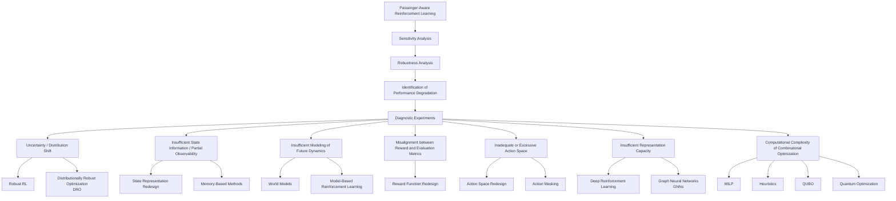

## ⭐ Interesting References

### attention 
- Veličković, P., Cucurull, G., Casanova, A., Romero, A., Lio, P., Bengio, Y., 2017. Graph attention networks. arXiv preprint https://arxiv.org/abs/1710.10903

- Kool, W., Van Hoof, H., Welling, M., 2018. Attention, learn to solve routing problems! arXiv preprint https://arxiv.org/abs/1803.08475  

## 📖 To Read
- 

## ✅ Read
- 

# Experiential Learning Cycle

| Step | Guiding Question |
|------|-------------------|
| **1. Concrete Experience** | **What did I try?** |
| **2. Reflective Observation** | **What happened?** |
| **3. Abstract Conceptualization** | **What did I learn?** |
| **4. Active Experimentation** | **What will I try next?** |

# ideas
